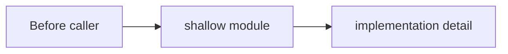
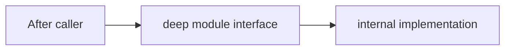

# cs-arch-review 参考模板

## index.md 模板

```markdown
---
doc_type: arch-review-index
review: {YYYY-MM-DD}-{slug}
scope: {审查范围一句话}
created: YYYY-MM-DD
status: active
total_candidates: {N}
source: adapted-from-improve-codebase-architecture
---

# {slug} architecture review

## 范围

{扫描了哪些目录 / 文件 / workflow，用户给的描述是什么}

## 读取材料

- `.cyralis/architecture/ARCHITECTURE.md` — {用到什么约束}
- `{architecture doc}` — {用到什么约束}
- `{requirement doc}` — {用到什么领域语言}
- `{decision/explore/learning}` — {用到什么历史结论}

## 总评

{一段话：发现几条 candidate，最强 friction 是什么，整体 top recommendation 是什么}

## Candidate 清单

| # | Strength | Candidate | Module / seam | Dependency | 建议下一步 |
|---|---|---|---|---|---|
| 1 | Strong | [candidate-01.md](candidate-01.md) | {module/seam} | in-process | cs-refactor |
| 2 | Worth exploring | [candidate-02.md](candidate-02.md) | {module/seam} | remote-owned | interface exploration |

## Top recommendation

**Candidate {NN}: {title}** — {为什么先做；必须使用 locality / leverage / test surface / seam placement 中至少一个词}

## 未展开观察

- {范围内看到但证据不足 / 优先级低 / 应另开 explore 的点}

## 下一步

- 想执行某条候选：走 `cs-refactor` 或 `cs-roadmap`
- 想继续比较 interface：指定 candidate，继续本技能的 interface exploration
- 想记录以后不要再建议的约束：走 `cs-decide`
```

## candidate-NN.md 模板

```markdown
---
doc_type: arch-review-candidate
review: {YYYY-MM-DD}-{slug}
candidate_id: "AR-{NN}"
strength: Strong | Worth exploring | Speculative
dependency_category: in-process | local-substitutable | remote-owned | true-external
suggested_action: cs-refactor | cs-roadmap | interface-exploration | cs-explore | cs-decide
status: open
tags: []
---

# Candidate {NN}: {title}

## 速答

{一句话：哪个 module / seam 是 shallow，为什么值得 deepening}

## 涉及文件

- `{file}` — {角色}
- `{file}` — {角色}

## 当前问题

{用 module / interface / implementation / seam / adapter / depth / shallow / locality / leverage / test surface 描述 friction}

## 关键证据

- `{file}:{line}` — {证据} — {它如何说明 shallow / locality 缺失 / seam 泄漏 / test surface 错位}
- `{file}:{line}` — {证据} — {说明}

## Deepening 方向

{plain English：什么会被吸收到 deep module 后面，interface 大概会缩到什么职责；不要给最终接口签名}

## Before / After





## 收益

- locality: {变化 / bug / 规则集中在哪里}
- leverage: {哪些 caller / tests 通过更小 interface 获益}
- test surface: {测试如何变得更稳定}

## 约束与冲突

- Active decision: {无 / 某 decision 约束}
- Architecture doc: {无 / 某 doc 当前说法}
- Conflict: {无 / 如有，为什么 friction 足够真实，值得用户决定是否重开}

## 建议动作

{`cs-refactor` / `cs-roadmap` / `interface-exploration` / `cs-explore` / `cs-decide`}，因为 {一句话理由}
```

## Strength 口径

- **Strong**：证据明确，friction 重复出现，locality / leverage / test surface 收益能落到后续动作。
- **Worth exploring**：问题真实，但 interface、依赖或 rollout 还需要用户继续 grill。
- **Speculative**：线索存在但证据不足；只能作为 follow-up explore 或观察项。

## Suggested action 口径

- `cs-refactor`：行为等价、范围能收在一次 refactor 内。
- `cs-roadmap`：跨模块目标态、接口契约会影响多条 feature。
- `interface-exploration`：候选强，但 interface 形状还需要比较。
- `cs-explore`：证据不足，需要先补调查。
- `cs-decide`：用户拒绝候选的理由是长期约束，未来 review 需要知道。
